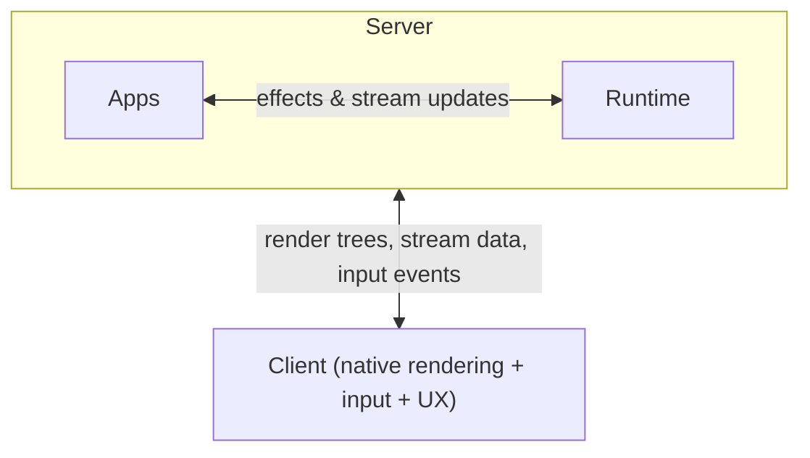

# Pond

A structured protocol for remote interfaces.

The terminal is still a byte stream pretending to be a UI system. Remote programs emit escape codes, clients reconstruct screens, and reconnect means replaying characters instead of restoring state. Pond replaces that boundary.

A Pond app does not paint a terminal. It declares:

1. **What should be visible** — a render tree
2. **What data it consumes or publishes** — typed streams
3. **What work it wants done** — effects

Everything else belongs to the platform.

## The model

### Render trees

Apps produce declarative widget trees, not escape codes.

Widgets (lists, editors, tables, trees) handle their own scrolling, selection, and focus. The client renders them natively from structured data rather than inferring them from text. The shape of the UI changes slowly; the data inside it changes constantly.

### Streams

Streams are named, typed, live channels of data.

Any program can publish to a stream or subscribe to one. Multiple consumers can observe the same stream at once. A transform is just another program: subscribe to one stream, publish another.

This makes composition explicit. Programs do not scrape text from one another's stdout. They exchange structured, typed data. Each intermediate stream is independently observable and subscribable.

### Effects

Apps don't touch the filesystem, spawn processes, or open sockets directly. They declare intent.

`readDir`, `exec`, `watch`, `open` — the runtime fulfills them. Results flow back as state updates and stream events; the app redraws.

Effects are plain data, which means they are serializable, inspectable, loggable, cacheable, replayable, and testable. Any language can produce them. An app can be tested by asserting which effects it emits, without performing them.

## Apps are guests

Apps don't own the screen, the render loop, or system access.

The platform handles layout, compositing, input routing, lifecycle, persistence, and capability enforcement. Multiple apps can be visible at once.

Apps survive disconnects — the runtime, not the client, holds their state. When you reconnect, the runtime sends back structured state: render trees, stream positions, session structure. Not a character grid. This is what makes Pond different from tmux.

## Architecture

- **Apps** describe UI and request work.
- **Runtime** fulfills effects locally on the server, owns durable state, and manages sessions. Written in OCaml. Wraps legacy programs (bash, vim) in PTYs as a compatibility layer; native Pond apps are the primary model.
- **Client** renders structured UI, sends input events back. Roughly 6-7 message types in each direction. Swappable — any client works, no app knows the difference.

The wire carries state, not terminal emulation.

## Open questions

- **How does the protocol evolve without breaking clients?**
  - If unknown message types are fatal, adding any new type breaks every deployed client
  - If they're silently ignored, old clients coexist with new runtimes
  - When do you need a capability flag (behavioral change, like "I understand render diffs") vs. just adding a field to an existing message?
- **Where does input translation happen?**
  - For native Pond widgets the client can translate "user pressed j" into "select row 4" with zero round trips
  - For PTY programs the runtime must translate structured key events back to escape sequences, which requires tracking terminal mode state
  - These are fundamentally different paths through the same protocol
- **Is layout in the protocol?**
  - Multiple apps visible at once — does the protocol carry where each app is on screen, or does the client own layout entirely?
  - If the client owns it, resize events need per-program viewport sizes
  - If the protocol owns it, every client must agree on a layout model
- **How do virtualized lists work over a wire?**
  - A 10,000-row table where only 50 rows are visible — locally (React, Flutter) this is solved, over a wire it isn't
  - The server must materialize rows fast enough for 60Hz scrolling, with pre-fetch to absorb round-trip latency
  - No existing wire protocol solves this

Resolved:
- Flow control and priority: [`docs/TRANSPORT.md`](docs/TRANSPORT.md) — application-level queues in v1, transport-level stream priority in v2 (QUIC)
- Wire format: [`docs/TRANSPORT.md`](docs/TRANSPORT.md) — MessagePack with length-prefixed framing
- Bootstrap: [`docs/TRANSPORT.md`](docs/TRANSPORT.md) — SSH exec avoids shell banners; native QUIC connection avoids SSH entirely
- App capabilities: [`docs/NETWORK.md`](docs/NETWORK.md) — capability tokens scope what each client and app can do

## Design decisions

- **Bind implies observation.** A render tree that references a stream is a declarative dependency — the runtime delivers that stream's data automatically. Clients don't send `subscribe` for bound streams. Explicit `subscribe` exists only for out-of-band observation (dashboards, inspectors, debuggers).
- **Resource lifecycle ≠ observation lifecycle.** A process doesn't die because the last widget unbound from its stream. Bind controls delivery to the client, not ownership of the underlying resource.
- **Render tree + bound data = one logical frame.** When the runtime sends a new render tree (or restores one on reconnect), it sends the current snapshot of all bound streams in the same logical commit. No blank flashes, no race between tree and data.
- **Priority send queues for v1, transport-level priority for v2.** In v1, the runtime drains control messages (input, kill, errors) before data, and caps per-program buffered output (~64KB). In v2, each Pond stream maps to a QUIC stream with independent flow control — the transport handles priority natively. See [`docs/TRANSPORT.md`](docs/TRANSPORT.md).
- **Effects are internal to the runtime.** The client never sees effects. Apps and runtime live on the server; effects are fulfilled locally over pipes. The wire carries only the results: render trees, stream data, input events.
- **Legacy PTY programs are normalized at the runtime boundary.** Pond never sends raw terminal bytes to clients, only structured terminal state. The runtime owns the PTY, feeds output into a server-side VTE, and sends cell diffs, cursor state, and mode updates. No raw-byte escape hatch. One contract, one reconnect story, one debugging surface.
- **The `terminal` widget contains all legacy complexity.** The cell grid format (colors, attributes, wide characters, cursor state) lives inside a single optional widget type, not in the core protocol. Native Pond apps never touch it. Clients that don't implement `terminal` can still render every native Pond app — legacy PTY support is a capability, not a requirement. See [`docs/TERMINAL_WIDGET.md`](docs/TERMINAL_WIDGET.md).
- **Client-owned widget state, server-owned application semantics.** Selection and activation are separate: the client highlights a row immediately (widget state), the server decides what happens (app state). Hover, focus, scroll, sort, filter, selection highlight — all local. Navigation, mutation, effects — round-trip. Identity-based, not index-based: interactions reference `item_id` + `render_version`, not "row 3." See [`docs/INPUT_LATENCY.md`](docs/INPUT_LATENCY.md).
- **Four identities, not two.** Effects are transactions (complete on commit). Resources are long-lived things the runtime manages (processes, watchers). Streams are observation surfaces on resources. Subscriptions are a client's attachment to a stream. Effects don't own streams — resources own producer bindings to streams. One effect can create multiple streams; a stream can outlive its spawning effect; reconnection works through stable stream IDs, not effect replay.
- **Reconnection is snapshot-first.** On reconnect, the runtime sends full current state per app (render tree + bound stream snapshots), focused app first. No deltas, no replay log, no progressive restore. Seq numbers continue, don't reset. Client-owned widget state (scroll position, selections, input contents) is lost in v1. A typical session is ~200KB; even a heavy 20-app session is ~2MB — under a second on any real connection.

## Implementation

OCaml. The protocol is message types as algebraic variants, the runtime is an effect interpreter, and the render tree is a recursive type — all things OCaml was built for.

Apps can be written in any language — they communicate with the runtime over stdin/stdout using the wire protocol. OCaml is the runtime language, not the app language.

## Status

Building the protocol and runtime.
