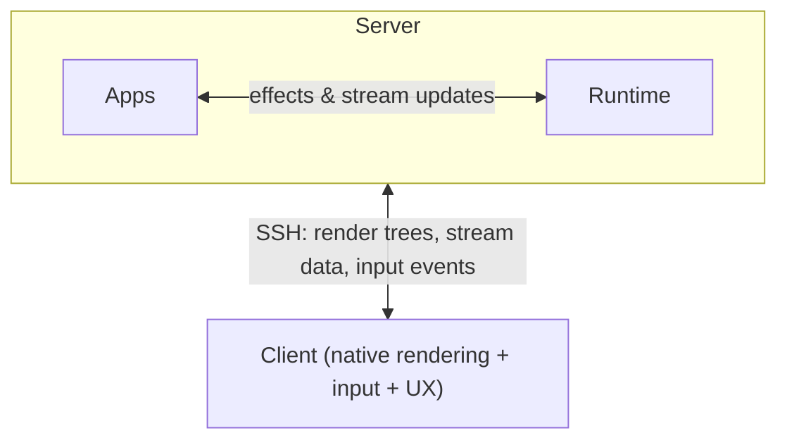

# Pond

A structured protocol for remote interfaces.

The terminal is still a byte stream pretending to be a UI system. Remote programs emit escape codes, clients reconstruct screens, and reconnect means replaying characters instead of restoring state. Pond replaces that boundary.

A Pond app does not paint a terminal. It declares:

1. **What should be visible** — a render tree
2. **What data it consumes or publishes** — typed streams
3. **What work it wants done** — effects

Everything else belongs to the platform.

## The model

### Render trees

Apps produce declarative widget trees, not escape codes.

Widgets (lists, editors, tables, trees) handle their own scrolling, selection, and focus. The client renders them natively from structured data rather than inferring them from text. The shape of the UI changes slowly; the data inside it changes constantly.

### Streams

Streams are named, typed, live channels of data.

Any program can publish to a stream or subscribe to one. Multiple consumers can observe the same stream at once. A transform is just another program: subscribe to one stream, publish another.

This makes composition explicit. Programs do not scrape text from one another's stdout. They exchange structured, typed data. Each intermediate stream is independently observable and subscribable.

### Effects

Apps don't touch the filesystem, spawn processes, or open sockets directly. They declare intent.

`readDir`, `exec`, `watch`, `open` — the runtime fulfills them. Results flow back as state updates and stream events; the app redraws.

Effects are plain data, which means they are serializable, inspectable, loggable, cacheable, replayable, and testable. Any language can produce them. An app can be tested by asserting which effects it emits, without performing them.

## Apps are guests

Apps don't own the screen, the render loop, or system access.

The platform handles layout, compositing, input routing, lifecycle, persistence, and capability enforcement. Multiple apps can be visible at once.

Apps survive disconnects — the runtime, not the client, holds their state. When you reconnect, the runtime sends back structured state: render trees, stream positions, session structure. Not a character grid. This is what makes Pond different from tmux.

## Architecture

- **Apps** describe UI and request work.
- **Runtime** fulfills effects locally on the server, owns durable state, and manages sessions. Single static binary, no dependencies — uploaded over SSH on first connect. Wraps legacy programs (bash, vim) in PTYs as a compatibility layer; native Pond apps are the primary model.
- **Client** renders structured UI, sends input events back. Roughly 6-7 message types in each direction. Swappable — any client works, no app knows the difference.

The wire carries state, not terminal emulation.

## Open questions

### Blocking v1

- **Are effects and streams one lifecycle or two?**
  - An `exec` effect completes instantly (process started) but its stdout stream runs for hours
  - A `watch` is ephemeral; an `exec` creates a durable resource (a PID)
  - If stream termination is coupled to effect completion, streams can't outlive their spawning effect, one effect can't produce multiple independent streams, and reconnection to running processes becomes impossible
- **How does reconnection transfer state?**
  - It requires version-tagged render trees, sequence-numbered streams, and a protocol for deciding delta vs. snapshot
  - Should input events carry the render version they were based on so the server can detect stale operations?
  - What happens to effects that completed while the client was disconnected?
- **Is SSH's flow control sufficient?**
  - A single fast producer (e.g. `find /` streaming results) fills the SSH send buffer and freezes every program's render updates plus the user's keystroke latency
  - TCP treats all bytes equally
  - Does the protocol need its own priority queues (input before renders, renders before bulk data), per-stream throttling, and window-based flow control for large transfers?
- **What can an app do by default?**
  - Right now any app can `exec` arbitrary commands, read any path, subscribe to any stream — zero isolation
  - Should apps declare capabilities upfront (Android permission model)?
  - Should the default be CWD-only for reads, nothing for writes and exec unless explicitly granted?

### Can wait

- **How does the protocol evolve without breaking clients?**
  - If unknown message types are fatal, adding any new type breaks every deployed client
  - If they're silently ignored, old clients coexist with new runtimes
  - The harder question: when do you need a capability flag (behavioral change, like "I understand render diffs") vs. just adding a field to an existing message (data change, which MessagePack handles for free)?
- **Where does input translation happen?**
  - For native Pond widgets the client can translate "user pressed j" into "select row 4" with zero round trips
  - For PTY programs the runtime must translate structured key events back to escape sequences, which requires tracking terminal mode state
  - These are fundamentally different paths through the same protocol
- **Is layout in the protocol?**
  - Multiple apps visible at once — does the protocol carry where each app is on screen, or does the client own layout entirely?
  - If the client owns it, resize events need per-program viewport sizes
  - If the protocol owns it, every client must agree on a layout model
- **How do virtualized lists work over a wire?**
  - A 10,000-row table where only 50 rows are visible — locally (React, Flutter) this is solved, over a wire it isn't
  - The server must materialize rows fast enough for 60Hz scrolling, with pre-fetch to absorb round-trip latency
  - No existing wire protocol solves this
- **JSON or MessagePack by default?**
  - JSON is debuggable, universal, and requires no library — `echo '{"type":"hello","version":1}' | nc -U ~/.pond/runtime.sock` just works
  - MessagePack is 34% smaller but unreadable without tools
  - SSH compresses both — does v1 ship debuggable and optimize later, or start binary?
- **How does SSH bootstrap actually work?**
  - Shell startup banners and `~/.bashrc` output corrupt framing
  - The runtime must daemonize without dying on SIGHUP when SSH drops
  - Binary upload (5-10MB) over a slow uplink blocks everything until complete

## Design decisions

- **Bind implies observation.** A render tree that references a stream is a declarative dependency — the runtime delivers that stream's data automatically. Clients don't send `subscribe` for bound streams. Explicit `subscribe` exists only for out-of-band observation (dashboards, inspectors, debuggers).
- **Resource lifecycle ≠ observation lifecycle.** A process doesn't die because the last widget unbound from its stream. Bind controls delivery to the client, not ownership of the underlying resource.
- **Render tree + bound data = one logical frame.** When the runtime sends a new render tree (or restores one on reconnect), it sends the current snapshot of all bound streams in the same logical commit. No blank flashes, no race between tree and data.
- **Priority send queues + per-program output caps are sufficient for v1.** tmux has the same single-connection architecture and handles it with kernel backpressure alone. The runtime drains control messages (input, kill, errors) before data, and caps per-program buffered output (~64KB). Credit-based flow control and multi-connection splits are available as escape hatches if real usage demands them.
- **Effects are internal to the runtime.** The client never sees effects. Apps and runtime live on the server; effects are fulfilled locally over pipes. The wire carries only the results: render trees, stream data, input events.
- **Legacy PTY programs are normalized at the runtime boundary.** Pond never sends raw terminal bytes to clients, only structured terminal state. The runtime owns the PTY, feeds output into a server-side VTE, and sends cell diffs, cursor state, and mode updates. Clients render cells — no VT parser required. No raw-byte escape hatch in v1. One contract, one reconnect story, one debugging surface.

## Status

Design phase.
